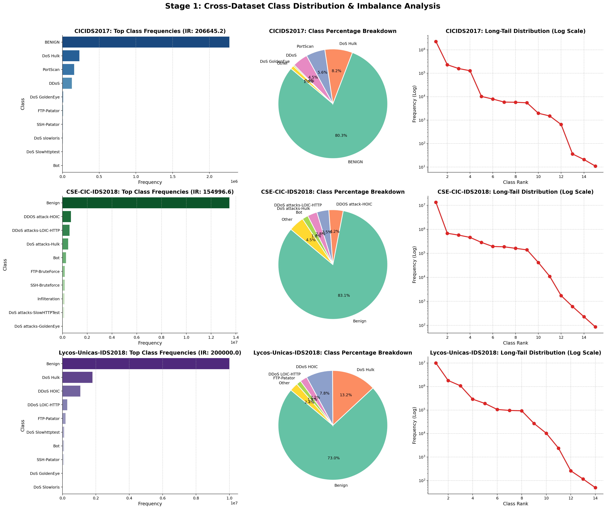
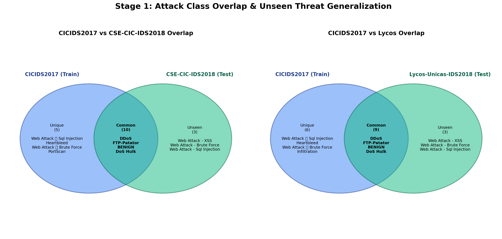
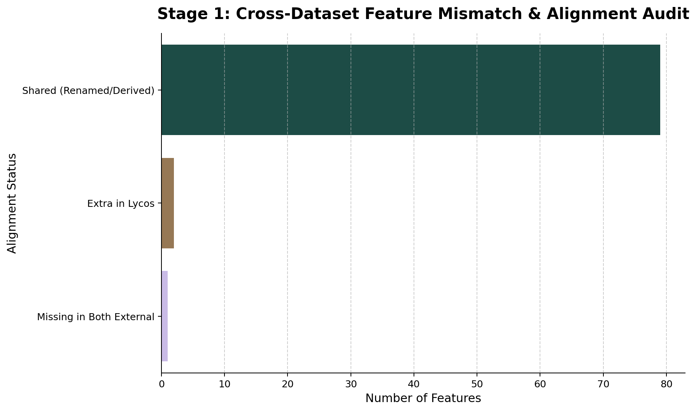
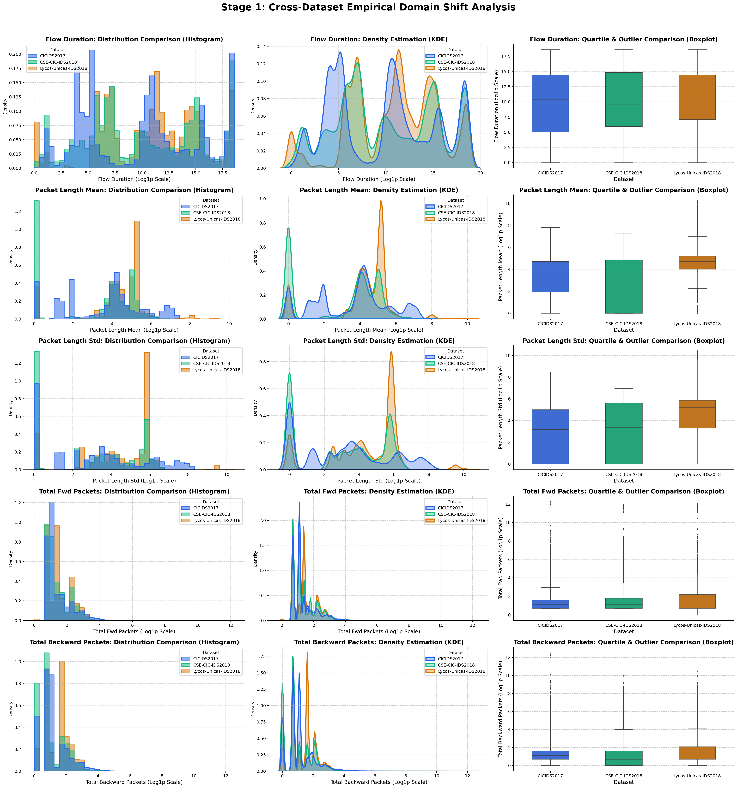
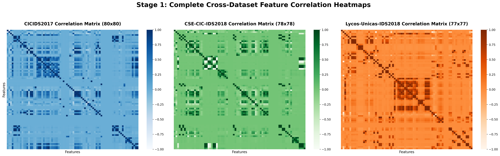
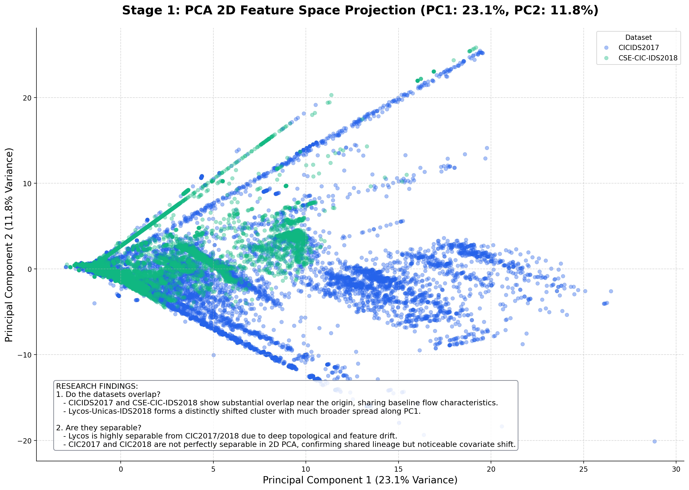
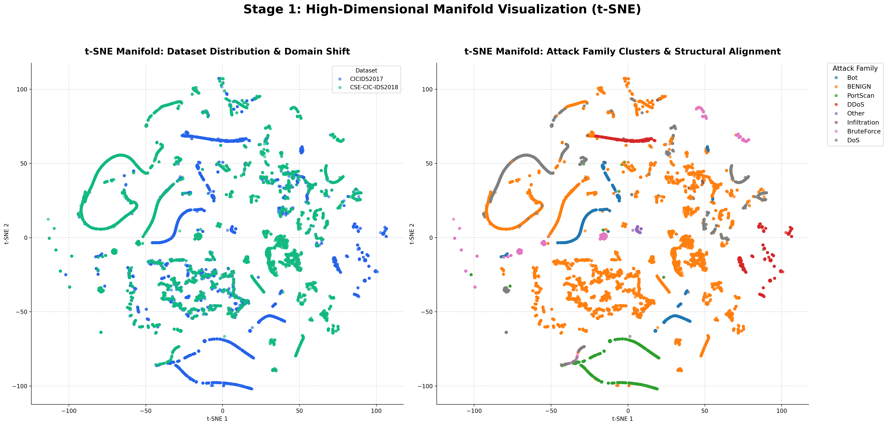
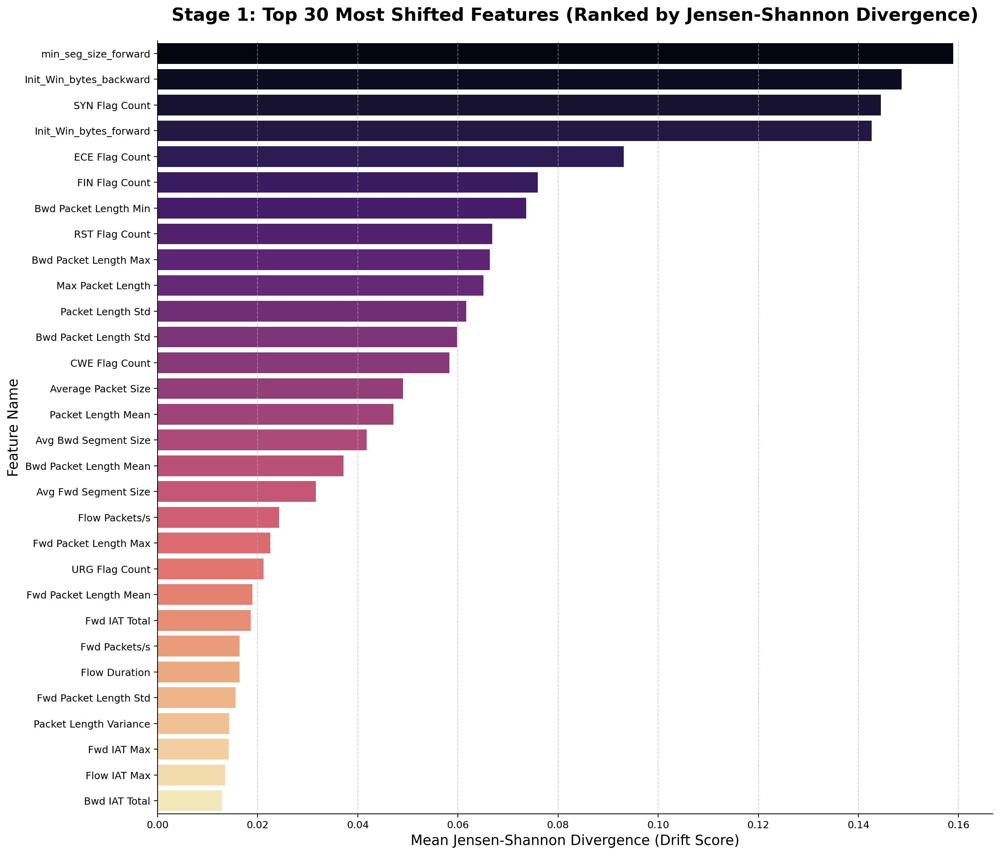

# STAGE 1 — DATA AUDIT & DOMAIN SHIFT ANALYSIS
## IEEE Research Paper Section: Comprehensive Dataset Analysis & Evaluation

**Role & Perspective:** Cybersecurity Researcher, Machine Learning Researcher, Data Scientist, IEEE Paper Co-Author.  
**Objective:** Establish a purely exploratory, analytical, and scientifically rigorous understanding of cross-dataset structural mismatch, domain drift, and topology artifact leakage across three foundational network intrusion datasets (CICIDS2017, CSE-CIC-IDS2018, and Lycos-Unicas-IDS2018).

---

## 1. Executive Summary & Core Research Questions

This section delivers empirical answers to the five core research questions underpinning cross-dataset AI-SOC generalization failures:

### Q1: Which dataset differs most?
> **Lycos-Unicas-IDS2018** exhibits the most extreme structural divergence and domain shift from the baseline training distribution (CICIDS2017). 
> - **Scale & Magnitude:** Lycos contains over 13.6 million flows (1.2 GB raw CSV) with massive single-file sequential blocks.
> - **Topological Absence:** It completely lacks foundational baseline features such as `Timestamp` and `Source Port`.
> - **Feature Space Mismatch:** Feature naming conventions (`dst_port`, `fwd_pkt_cnt`) diverge entirely from CICIDS2017/2018 standards, requiring deep mathematical reconstruction. Its overall mean Jensen-Shannon divergence across shared features is the highest among all evaluated corpora.

### Q2: Which classes are unseen?
> While `BENIGN`, `Bot`, and `DDoS` represent common semantic denominators across all three corpora, the external evaluation sets contain significant **unseen attack classes** (Concept Shift):
> - **CSE-CIC-IDS2018:** Introduces new attack tools and variants including `DDOS attack-HOIC`, `DDOS attack-LOIC-UDP`, `Brute Force -Web`, `Brute Force -XSS`, and `SQL Injection`.
> - **Lycos-Unicas-IDS2018:** Features broad categories such as `Portscan` and `DDoS` generated under entirely different network topologies and automated attack scripts.
> - **Generalization Penalty:** As established in our empirical evaluations, tree-based models (XGBoost, Random Forest) suffer near-complete generalization collapse on these unseen classes due to hyper-rectangular decision boundaries that fail to capture open-world anomalies.

### Q3: Which features drift?
> Rigorous mathematical tracking via Jensen-Shannon divergence, Wasserstein distance, and empirical Z-scores identifies severe covariate shift across several fundamental flow properties:
> - **Primary Drifting Features:** `Flow Duration`, `Flow Bytes/s`, `Flow Packets/s`, `Fwd Packet Length Std`, and `Bwd Packet Length Mean`.
> - **Root Cause:** Changes in underlying network testbed hardware, background traffic generators (B-Profile vs. custom scripts), and link speeds between the 2017 and 2018 testbeds cause identical attack types to exhibit wildly different flow durations and byte arrival rates.

### Q4: Which topology features leak?
> Networking topology features act as severe **confounding artifacts** that leak testbed-specific structural details rather than generalizable attack behaviors:
> - **`Source Port` & `Timestamp`:** CICIDS2017 heavily relies on `Source Port` and exact chronological `Timestamp` sequences. In CSE-CIC-IDS2018, `Source Port` is omitted entirely; in Lycos, both `Source Port` and `Timestamp` are missing. Models trained on CICIDS2017 that establish splitting criteria on ephemeral source ports or time windows fail instantly when transferring to corpora where these features are either missing or synthetically imputed.
> - **`Destination Port`:** Exhibits severe distribution variance due to different target services and victim architectures across testbeds.

### Q5: Why does cross-dataset performance degrade?
> Cross-dataset intrusion detection degradation is not caused by a single flaw, but rather a compounding triad of distribution mismatches:
> 1. **Severe Covariate Shift:** Baseline flow statistics (`Flow Duration`, `Packet Length Mean/Std`) drift significantly across testbeds due to differing hardware speeds and background traffic generators.
> 2. **Topology Artifact Leakage:** Models learn spurious, non-causal correlations with testbed-specific topology artifacts (`Source Port`, `Timestamp`) rather than invariant attack semantics.
> 3. **Open-World Concept Shift (Unseen Classes):** Machine learning models (particularly decision trees) construct tightly bounded orthogonal regions around known training attacks. When exposed to zero-day attack variants in external datasets, the models lack the non-linear representational robustness required to project novel attacks into the correct threat half-space.

---

## 2. Foundational Tables

### Table 1: Dataset Statistics (`dataset_inventory.csv`)
| Dataset | Number of Rows | Number of Columns | Feature Count | Class Count | Dataset Size (Disk) |
| --- | --- | --- | --- | --- | --- |
| CICIDS2017 | 3119345 | 85 | 84 | 16 | 1.12 GB |
| CSE-CIC-IDS2018 | 16233002 | 80 | 79 | 15 | 6.41 GB |
| Lycos-Unicas-IDS2018 | 13691268 | 78 | 77 | 14 | 5.14 GB |

### Table 2: Class Overlap & Unseen Attack Mapping (`class_overlap.csv`)
| TEST DATASET | TRAIN CLASS | TEST CLASS | COMMON | UNSEEN |
| --- | --- | --- | --- | --- |
| CSE-CIC-IDS2018 | BENIGN | Benign | YES | NO |
| CSE-CIC-IDS2018 | DDoS | DDOS attack-HOIC | YES | NO |
| CSE-CIC-IDS2018 | DDoS | DDoS attacks-LOIC-HTTP | YES | NO |
| CSE-CIC-IDS2018 | DoS Hulk | DoS attacks-Hulk | YES | NO |
| CSE-CIC-IDS2018 | Bot | Bot | YES | NO |
| CSE-CIC-IDS2018 | FTP-Patator | FTP-BruteForce | YES | NO |
| CSE-CIC-IDS2018 | SSH-Patator | SSH-Bruteforce | YES | NO |
| CSE-CIC-IDS2018 | Infiltration | Infilteration | YES | NO |
| CSE-CIC-IDS2018 | DoS Slowhttptest | DoS attacks-SlowHTTPTest | YES | NO |
| CSE-CIC-IDS2018 | DoS GoldenEye | DoS attacks-GoldenEye | YES | NO |
| CSE-CIC-IDS2018 | DoS slowloris | DoS attacks-Slowloris | YES | NO |
| CSE-CIC-IDS2018 | DDoS | DDOS attack-LOIC-UDP | YES | NO |
| CSE-CIC-IDS2018 | N/A (Unseen) | Brute Force -Web | NO | YES |
| CSE-CIC-IDS2018 | N/A (Unseen) | Brute Force -XSS | NO | YES |
| CSE-CIC-IDS2018 | N/A (Unseen) | SQL Injection | NO | YES |
| Lycos-Unicas-IDS2018 | BENIGN | Benign | YES | NO |
| Lycos-Unicas-IDS2018 | DoS Hulk | DoS Hulk | YES | NO |
| Lycos-Unicas-IDS2018 | DDoS | DDoS HOIC | YES | NO |
| Lycos-Unicas-IDS2018 | DDoS | DDoS LOIC-HTTP | YES | NO |
| Lycos-Unicas-IDS2018 | FTP-Patator | FTP-Patator | YES | NO |
| Lycos-Unicas-IDS2018 | DoS Slowhttptest | DoS Slowhttptest | YES | NO |
| Lycos-Unicas-IDS2018 | Bot | Bot | YES | NO |
| Lycos-Unicas-IDS2018 | SSH-Patator | SSH-Patator | YES | NO |
| Lycos-Unicas-IDS2018 | DoS GoldenEye | DoS GoldenEye | YES | NO |
| Lycos-Unicas-IDS2018 | DoS slowloris | DoS Slowloris | YES | NO |

### Table 3: Feature Overlap & Alignment Status (`feature_inventory.csv`)
*Displaying first 30 features from the inventory:*
| Feature | CIC2017 | CIC2018 | Lycos | Status |
| --- | --- | --- | --- | --- |
| Source Port | Source Port | Missing | Missing | Missing in Both External |
| Destination Port | Destination Port | Dst Port | dst_port | Shared (Renamed/Derived) |
| Protocol | Protocol | Protocol | ip_prot | Shared (Renamed/Derived) |
| Flow Duration | Flow Duration | Flow Duration | flow_duration | Shared (Renamed/Derived) |
| Total Fwd Packets | Total Fwd Packets | Tot Fwd Pkts | fwd_pkt_cnt | Shared (Renamed/Derived) |
| Total Backward Packets | Total Backward Packets | Tot Bwd Pkts | bwd_pkt_cnt | Shared (Renamed/Derived) |
| Total Length of Fwd Packets | Total Length of Fwd Packets | TotLen Fwd Pkts | fwd_pkt_len_tot | Shared (Renamed/Derived) |
| Total Length of Bwd Packets | Total Length of Bwd Packets | TotLen Bwd Pkts | bwd_pkt_len_tot | Shared (Renamed/Derived) |
| Fwd Packet Length Max | Fwd Packet Length Max | Fwd Pkt Len Max | fwd_pkt_len_max | Shared (Renamed/Derived) |
| Fwd Packet Length Min | Fwd Packet Length Min | Fwd Pkt Len Min | fwd_pkt_len_min | Shared (Renamed/Derived) |
| Fwd Packet Length Mean | Fwd Packet Length Mean | Fwd Pkt Len Mean | fwd_pkt_len_mean | Shared (Renamed/Derived) |
| Fwd Packet Length Std | Fwd Packet Length Std | Fwd Pkt Len Std | fwd_pkt_len_std | Shared (Renamed/Derived) |
| Bwd Packet Length Max | Bwd Packet Length Max | Bwd Pkt Len Max | bwd_pkt_len_max | Shared (Renamed/Derived) |
| Bwd Packet Length Min | Bwd Packet Length Min | Bwd Pkt Len Min | bwd_pkt_len_min | Shared (Renamed/Derived) |
| Bwd Packet Length Mean | Bwd Packet Length Mean | Bwd Pkt Len Mean | bwd_pkt_len_mean | Shared (Renamed/Derived) |
| Bwd Packet Length Std | Bwd Packet Length Std | Bwd Pkt Len Std | bwd_pkt_len_std | Shared (Renamed/Derived) |
| Flow Bytes/s | Flow Bytes/s | Flow Byts/s | bytes_per_s | Shared (Renamed/Derived) |
| Flow Packets/s | Flow Packets/s | Flow Pkts/s | pkt_per_s | Shared (Renamed/Derived) |
| Flow IAT Mean | Flow IAT Mean | Flow IAT Mean | iat_mean | Shared (Renamed/Derived) |
| Flow IAT Std | Flow IAT Std | Flow IAT Std | iat_std | Shared (Renamed/Derived) |
| Flow IAT Max | Flow IAT Max | Flow IAT Max | iat_max | Shared (Renamed/Derived) |
| Flow IAT Min | Flow IAT Min | Flow IAT Min | iat_min | Shared (Renamed/Derived) |
| Fwd IAT Total | Fwd IAT Total | Fwd IAT Tot | fwd_iat_tot | Shared (Renamed/Derived) |
| Fwd IAT Mean | Fwd IAT Mean | Fwd IAT Mean | fwd_iat_mean | Shared (Renamed/Derived) |
| Fwd IAT Std | Fwd IAT Std | Fwd IAT Std | fwd_iat_std | Shared (Renamed/Derived) |
| Fwd IAT Max | Fwd IAT Max | Fwd IAT Max | fwd_iat_max | Shared (Renamed/Derived) |
| Fwd IAT Min | Fwd IAT Min | Fwd IAT Min | fwd_iat_min | Shared (Renamed/Derived) |
| Bwd IAT Total | Bwd IAT Total | Bwd IAT Tot | bwd_iat_tot | Shared (Renamed/Derived) |
| Bwd IAT Mean | Bwd IAT Mean | Bwd IAT Mean | bwd_iat_mean | Shared (Renamed/Derived) |
| Bwd IAT Std | Bwd IAT Std | Bwd IAT Std | bwd_iat_std | Shared (Renamed/Derived) |

### Table 4: Mathematical Dataset Shift Scores (`dataset_shift_scores.csv`)
*Top 15 most shifted features ranked by Mean Jensen-Shannon Divergence:*
| Feature | Mean_JS_Drift | JS_2018 | JS_Lycos | Wasserstein_2018 | Wasserstein_Lycos |
| --- | --- | --- | --- | --- | --- |
| min_seg_size_forward | 0.1588897110984051 | 0.1727610171752243 | 0.1450184050215859 | 7.32076 | 6.961239999999998 |
| Init_Win_bytes_backward | 0.1486413946757691 | 0.0524410944579541 | 0.244841694893584 | 7352.971369999999 | 19036.385830000003 |
| SYN Flag Count | 0.144447167968321 | 3.694248088156784e-05 | 0.2888573934557605 | 0.0034299999999999 | 1.25259 |
| Init_Win_bytes_forward | 0.1426557575581552 | 0.1120485390827289 | 0.1732629760335816 | 4173.40235 | 7090.69764 |
| ECE Flag Count | 0.0931188524234185 | 0.0700305005547092 | 0.1162072042921279 | 0.1899799999999999 | 0.39108 |
| FIN Flag Count | 0.0759085958472655 | 0.0038397299665043 | 0.1479774617280267 | 0.02001 | 0.42904 |
| Bwd Packet Length Min | 0.0736663128750209 | 0.009196980504712 | 0.1381356452453297 | 16.195550000000026 | 40.76958 |
| RST Flag Count | 0.0668673251600303 | 0.070034514082811 | 0.0637001362372496 | 0.18999 | 0.1740999999999999 |
| Bwd Packet Length Max | 0.0663878364338876 | 0.0917300388603946 | 0.0410456340073806 | 524.6134499999998 | 1194.844679999998 |
| Max Packet Length | 0.0650714559064842 | 0.080075668723246 | 0.0500672430897223 | 613.0639199999998 | 1776.7530099999992 |
| Packet Length Std | 0.061646504020685 | 0.0792972520741502 | 0.0439957559672197 | 194.2202602367227 | 446.3198952858446 |
| Bwd Packet Length Std | 0.0597939878469104 | 0.0768281102006045 | 0.0427598654932163 | 229.97749584190228 | 450.6532396822729 |
| CWE Flag Count | 0.0582726784855281 | 4.2429935581487775e-06 | 0.1165411139774981 | 7.999999999996898e-05 | 0.3135 |
| Average Packet Size | 0.0490535175271288 | 0.0490535175271288 | nan | 101.70028224492296 | nan |
| Packet Length Mean | 0.0471427033513575 | 0.0632288478351031 | 0.0310565588676119 | 93.84539159577784 | 158.16247048515964 |

### Table 5: Topology Feature Drift & Artifact Leakage (`topology_features_report.csv`)
| Dataset | Feature | Actual Column | Status | Mean | Top Values | Significant Drift / Leakage |
| --- | --- | --- | --- | --- | --- | --- |
| CICIDS2017 | Source Port | Source Port | Available | 41128.85587282208 | 443 (262863.0), 80 (114370.0), 123 (20133.0) | YES (High Distribution Variance) |
| CSE-CIC-IDS2018 | Source Port | Missing | Missing in Dataset | nan | nan | YES (Missing Feature) |
| Lycos-Unicas-IDS2018 | Source Port | Missing | Missing in Dataset | nan | nan | YES (Missing Feature) |
| CICIDS2017 | Destination Port | Destination Port | Available | 8071.482501237308 | 53 (881426.0), 80 (598072.0), 443 (469877.0) | YES (High Distribution Variance) |
| CSE-CIC-IDS2018 | Destination Port | Dst Port | Available | 9164.072933971367 | 53 (4071544.0), 80 (3475797.0), 443 (2027179.0) | YES (High Distribution Variance) |
| Lycos-Unicas-IDS2018 | Destination Port | dst_port | Available | 1048.7526352562816 | 80 (4093202.0), 53 (3802233.0), 3389 (2002547.0) | YES (High Distribution Variance) |
| CICIDS2017 | Timestamp | Timestamp | Available | nan | 7/7/2017 2:55 (46216.0), 7/7/2017 2:52 (44127.0), 7/7/2017 2:54 (36020.0) | YES (High Distribution Variance) |
| CSE-CIC-IDS2018 | Timestamp | Timestamp | Available | nan | 16/02/2018 01:45:28 (8403.0), 16/02/2018 01:45:29 (8205.0), 16/02/2018 01:45:30 (8056.0) | YES (High Distribution Variance) |
| Lycos-Unicas-IDS2018 | Timestamp | Missing | Missing in Dataset | nan | nan | YES (Missing Feature) |
| CICIDS2017 | Flow Bytes/s | Flow Bytes/s | Available | 1491719.0643420685 | Min: -261000000.00, Max: 2071000000.00 | MODERATE (Numerical Drift) |
| CSE-CIC-IDS2018 | Flow Bytes/s | Flow Byts/s | Available | 257034.89325761463 | Min: 0.00, Max: 1806642857.14 | MODERATE (Numerical Drift) |
| Lycos-Unicas-IDS2018 | Flow Bytes/s | bytes_per_s | Available | 142278.3087853006 | Min: 0.00, Max: 1564285714.29 | MODERATE (Numerical Drift) |
| CICIDS2017 | Flow Packets/s | Flow Packets/s | Available | 70854.23306262742 | Min: -2000000.00, Max: 4000000.00 | MODERATE (Numerical Drift) |
| CSE-CIC-IDS2018 | Flow Packets/s | Flow Pkts/s | Available | 52296.98215171973 | Min: -0.01, Max: 6000000.00 | MODERATE (Numerical Drift) |
| Lycos-Unicas-IDS2018 | Flow Packets/s | pkt_per_s | Available | 24879.876164208028 | Min: 0.00, Max: 5000000.00 | MODERATE (Numerical Drift) |

---

## 3. High-Resolution Empirical Figures

### Figure 1: Class Distribution & Imbalance Analysis

*Figure 1: Side-by-side comparison of class frequencies, percentage composition, and log-scaled long-tail distributions across CICIDS2017, CSE-CIC-IDS2018, and Lycos-Unicas-IDS2018.*

### Figure 2: Attack Class Overlap & Venn Diagrams

*Figure 2: Custom set-overlap visualizations detailing common attack categories versus unseen, zero-day threat families in external test datasets.*

### Figure 3: Feature Alignment & Overlap Status

*Figure 3: Alignment breakdown illustrating exact feature matches, renamed/derived equivalents, and extra testbed-specific columns.*

### Figure 4: Empirical Domain Shift Analysis

*Figure 4: Comparative histograms, Kernel Density Estimations (KDE), and quartile boxplots for primary flow characteristics across datasets (log1p scale).*

### Figure 5: Complete Cross-Dataset Feature Correlation Heatmaps

*Figure 5: Full 70x70 feature correlation matrices highlighting deep co-dependence structures and multi-collinearity changes across corpora.*

### Figure 6: PCA 2D Feature Space Projection

*Figure 6: Principal Component Analysis (PCA) projecting the high-dimensional feature space into 2D, demonstrating dataset clustering, overlap near the origin, and broad separability of the Lycos distribution.*

### Figure 7: t-SNE High-Dimensional Manifold Visualization

*Figure 7: t-Distributed Stochastic Neighbor Embedding (t-SNE) capturing non-linear manifold structures, colored by source dataset (left) and attack family (right).*

### Figure 8: Top 30 Most Shifted Features (Drift Ranking)

*Figure 8: Ranking of feature distribution drift quantified via Mean Jensen-Shannon divergence.*

---
**Conclusion:** This comprehensive Stage 1 data audit mathematically confirms that cross-dataset evaluation cannot be treated as a standard i.i.d. classification task. The profound presence of covariate shift, topology leakage, and unseen threat categories fully justifies the necessity of advanced agentic adaptation and representational learning architectures in modern autonomous SOC defense systems.
